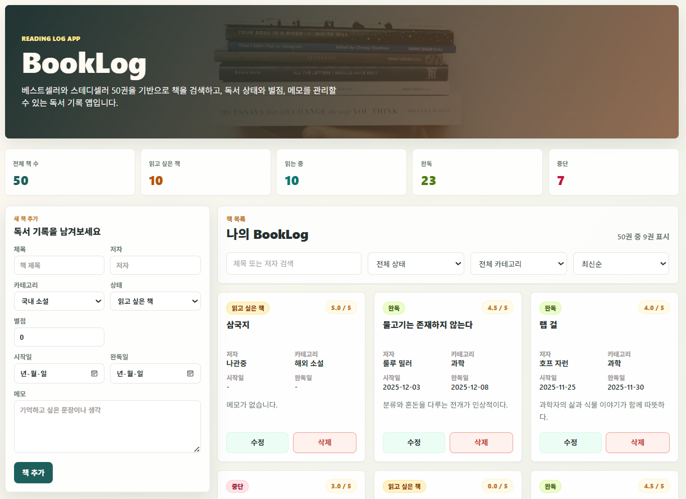

# BookLog


베스트셀러와 스테디셀러 50권을 기반으로 책을 검색하고, 독서 상태와 별점, 메모를 관리할 수 있는 React + Express + MongoDB 기반 독서 기록 CRUD 앱입니다.

## 화면 미리보기

아래 이미지는 BookLog 메인 화면입니다.



## 프로젝트 문서

| 문서 | Markdown | PDF |
|---|---|---|
| 요구사항 정의서 | [docs/requirements.md](docs/requirements.md) | [docs/pdf/requirements.pdf](docs/pdf/requirements.pdf) |
| 와이어프레임 | [docs/wireframe.md](docs/wireframe.md) | [docs/pdf/wireframe.pdf](docs/pdf/wireframe.pdf) |

## 주요 기능

- 도서 50권 seed 데이터 제공
- 도서 목록 조회
- 도서 추가
- 도서 수정
- 도서 삭제
- 삭제 확인 커스텀 모달
- 제목/저자 검색
- 독서 상태 필터
- 카테고리 필터
- 정렬 기능: 최신순, 별점 높은순, 제목순, 완독일순
- 페이지네이션
- 통계 카드
- 요구사항 정의서와 와이어프레임 문서 제공
- MongoDB 기반 데이터 저장
- Docker MongoDB 컨테이너 실행

## 기술 스택

- Frontend: React, Vite, Tailwind CSS, CSS
- Backend: Node.js, Express
- Database: MongoDB, Mongoose
- Dev Environment: Docker, GitHub Codespaces
- API 통신: fetch API

## 폴더 구조

```text
.
├─ booklog/
│  ├─ .gitignore
│  ├─ backend/
│  │  ├─ server.js
│  │  ├─ seed.js
│  │  ├─ models/
│  │  │  └─ Book.js
│  │  ├─ routes/
│  │  │  └─ books.js
│  │  ├─ package.json
│  │  └─ package-lock.json
│  │
│  └─ frontend/
│     ├─ index.html
│     ├─ vite.config.js
│     ├─ tailwind.config.js
│     ├─ postcss.config.js
│     ├─ src/
│     │  ├─ main.jsx
│     │  ├─ App.jsx
│     │  ├─ App.css
│     │  └─ api/
│     │     └─ books.js
│     ├─ package.json
│     └─ package-lock.json
│
├─ docs/
│  ├─ images/
│  │  └─ booklog-main.png
│  ├─ requirements.md
│  ├─ wireframe.md
│  ├─ html/                  # PDF 변환용 HTML 원본
│  │  ├─ requirements.html
│  │  └─ wireframe.html
│  └─ pdf/
│     ├─ requirements.pdf
│     └─ wireframe.pdf
│
├─ scripts/
│  └─ generate-pdf.js
├─ package.json
├─ package-lock.json
├─ .gitignore
└─ README.md
```

## 실행 방법

### 1. MongoDB Docker 컨테이너 실행

```bash
docker run -d --name mongodb-lab -p 27017:27017 mongo
```

이미 컨테이너가 있다면:

```bash
docker start mongodb-lab
```

### 2. Backend 실행

```bash
cd booklog/backend
npm install
npm run seed
npm run dev
```

Backend 기본 주소는 `http://localhost:5000`입니다.

### 3. Frontend 실행

```bash
cd booklog/frontend
npm install
npm run dev
```

### 4. 접속 주소

```text
http://localhost:5173
```

GitHub Codespaces 환경에서는 **Ports** 탭에서 `5173` 포트를 열어 화면을 확인할 수 있습니다.

## 환경 변수

MongoDB 연결 주소는 기본값으로 아래 주소를 사용합니다.

```text
mongodb://localhost:27017/booklog
```

`MONGO_URI` 환경변수가 있으면 해당 값을 우선 사용합니다.

```bash
MONGO_URI=mongodb://localhost:27017/booklog npm run dev
```

Frontend에서 백엔드 API 주소를 바꾸고 싶다면 `VITE_API_BASE_URL`을 사용할 수 있습니다.

```bash
VITE_API_BASE_URL=http://localhost:5000 npm run dev
```

## PDF 문서 생성 방법

문서 PDF는 `docs/html` 폴더의 HTML 원본을 기준으로 생성합니다.

```bash
npm install
npm run docs:pdf
```

최종 PDF 산출물은 `docs/pdf` 폴더에서 확인할 수 있습니다.

## API 명세

| Method | Endpoint | 설명 | Request Body / Query |
|---|---|---|---|
| GET | `/books` | 책 목록 조회 | Query: `q` 제목/저자 검색, `status` 독서 상태 필터, `category` 카테고리 필터. 기본 응답은 최신순이며, 별점/제목/완독일 정렬은 Frontend 상태에서 처리 |
| GET | `/books/:id` | 책 상세 조회 | Path Parameter: `id` |
| POST | `/books` | 책 추가 | Body: `title`, `author`, `category`, `status`, `rating`, `memo`, `startDate`, `endDate` |
| PUT | `/books/:id` | 책 수정 | Path Parameter: `id`, Body: 수정할 Book 필드 |
| DELETE | `/books/:id` | 책 삭제 | Path Parameter: `id` |

## Book 데이터 구조

| 필드 | 타입 | 설명 |
|---|---|---|
| `title` | `String` | 책 제목, required |
| `author` | `String` | 저자 |
| `category` | `String` | 카테고리 |
| `status` | `String` | 독서 상태 |
| `rating` | `Number` | 별점, 0~5 |
| `memo` | `String` | 메모 |
| `startDate` | `String` | 독서 시작일 |
| `endDate` | `String` | 완독일 |
| `createdAt` | `Date` | 생성일 |

`status` 값은 아래 네 가지를 사용합니다.

| 값 | 의미 |
|---|---|
| `want` | 읽고 싶은 책 |
| `reading` | 읽는 중 |
| `done` | 완독 |
| `paused` | 중단 |

## API Request Body 예시

### POST /books

```json
{
  "title": "삼국지",
  "author": "나관중",
  "category": "해외 소설",
  "status": "want",
  "rating": 5,
  "memo": "읽어보고 싶은 고전 소설",
  "startDate": "",
  "endDate": ""
}
```

### PUT /books/:id

```json
{
  "title": "삼국지",
  "author": "나관중",
  "category": "해외 소설",
  "status": "reading",
  "rating": 4.5,
  "memo": "다시 읽는 중",
  "startDate": "2026-06-03",
  "endDate": ""
}
```

## 학습 포인트

- Docker로 MongoDB 컨테이너 실행
- Express와 MongoDB 연결
- Mongoose Schema/Model 작성
- REST API 기반 CRUD 구현
- React에서 fetch API로 백엔드 API 호출
- 검색, 필터, 정렬, 페이지네이션 상태 관리
- seed.js를 활용한 초기 데이터 삽입
- 커스텀 삭제 확인 모달 구현
- 요구사항 정의서 작성
- 와이어프레임 문서화
- 문서 PDF 생성 스크립트 구성

## 향후 개선 사항

- 독서 상태 빠른 변경 기능
- 월별 독서 통계
- 다크모드
- 사용자별 독서 기록 관리
- 배포 환경 구성
